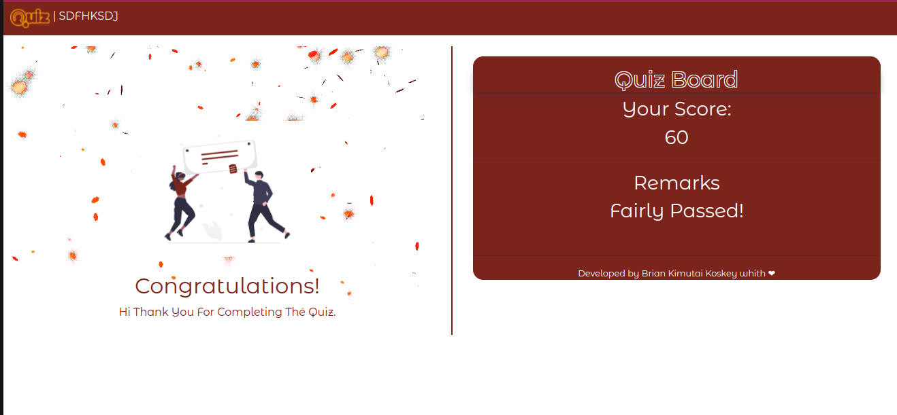

# Quiz Board
## By Brian Kimutai Koskei
## Screenshot
 
 ## Table of Content
 - [Description](#description)
 - [Landing Page](#Landing-Page)
 - [Instructions](#Instructions)
 - [Requirement](#Requirements)

 - [Installation Process](#installation-Process)
 - [Live Link](#Live-Link)
 - [Figma Link](#Figma-Link)

 - [Technology  Used](#technology-Used)
 - [Licence](#licence)
 - [Authors Info](#Authors-Info)
 ## Description
 
This is a straightforward UI-driven project. It is used to assess students' understanding of JavaScript. They respond to javascript questions and receive scores and comments.

## Landing page
This is the page where students' names are collected. In order to progress.
[Go Back to the top](#Screenshot)

## Instructions
This page gives the instructions of the test.
[Go Back to the top](#Screenshot)

 ###  Requirements
 * Access to  a computer or any other accessory such as a phone
 * Access to internet
 
 ### Installation Process
 ****
* Clone to this repo : git clone https://github.com/borebrian2021/Moringa-Quiz-Project-Javascript.git
* Unzip the downloaded files in a folder of choice.
* Open the index file from the zipped file with any browser.
 ****
 [Go Back to the top](#Screenshot)
### Live Link
- Click this link to view the live application https://borebrian2021.github.io/Moringa-Quiz-Project-Javascript/
### Figma Link
- Click this link to view the figma design of this project https://www.figma.com/file/MYat56ANGYAA2FQpkcapnx/Untitled?node-id=0%3A1
### Technology  Used
* HTML - which was used to develope the structure off the pages.
* VANILLA CSS - which was used to style the User Interface.
* Bootstraps-Used for dealing with page responsiveness.
* JQuery-It was used to add animation to the project.
* VANILLA Javascript-Used to make page interactive.

## Licence
MIT License
Copyright (c) [2022] [Brian Kimutai]
Permission is hereby granted, free of charge, to any person obtaining a copy
of this software and associated documentation files (the "Software"), to deal
in the Software without restriction, including without limitation the rights
to use, copy, modify, merge, publish, distribute, sublicense, and/or sell
copies of the Software, and to permit persons to whom the Software is
furnished to do so, subject to the following conditions:
The above copyright notice and this permission notice shall be included in all
copies or substantial portions of the Software.
THE SOFTWARE IS PROVIDED "AS IS", WITHOUT WARRANTY OF ANY KIND, EXPRESS OR
IMPLIED, INCLUDING BUT NOT LIMITED TO THE WARRANTIES OF MERCHANTABILITY,
FITNESS FOR A PARTICULAR PURPOSE AND NONINFRINGEMENT. IN NO EVENT SHALL THE
AUTHORS OR COPYRIGHT HOLDERS BE LIABLE FOR ANY CLAIM, DAMAGES OR OTHER
LIABILITY, WHETHER IN AN ACTION OF CONTRACT, TORT OR OTHERWISE, ARISING FROM,
OUT OF OR IN CONNECTION WITH THE SOFTWARE OR THE USE OR OTHER DEALINGS IN THE
SOFTWARE.
[Go Back to the top](#Screenshot)
## Authors Info
Linkedin - [Brain Koskei Kimutai](https://www.linkedin.com/in/bore-brian-5655b814b/)